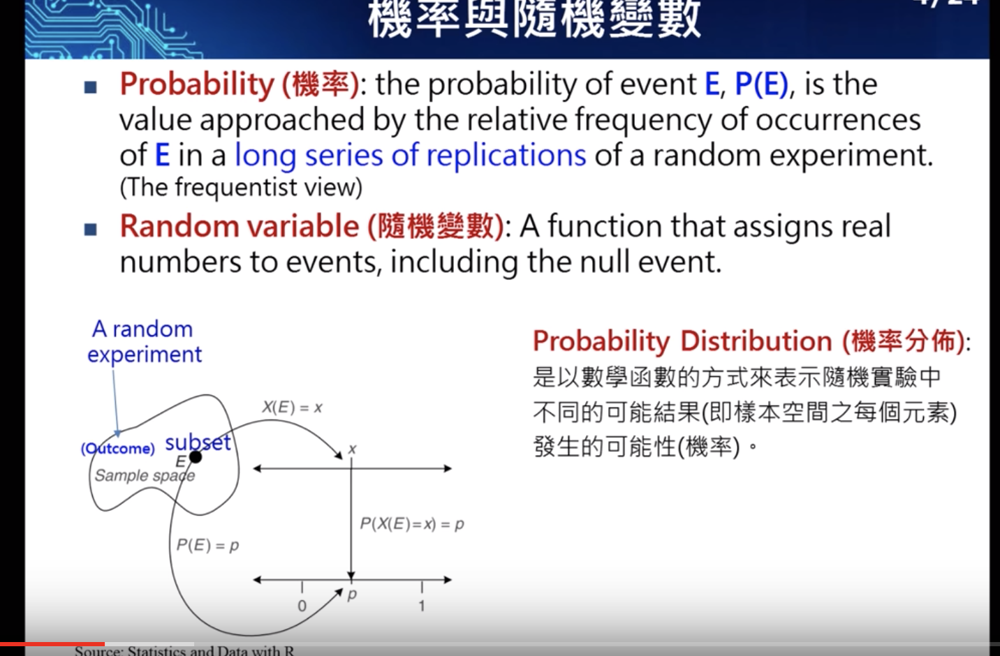
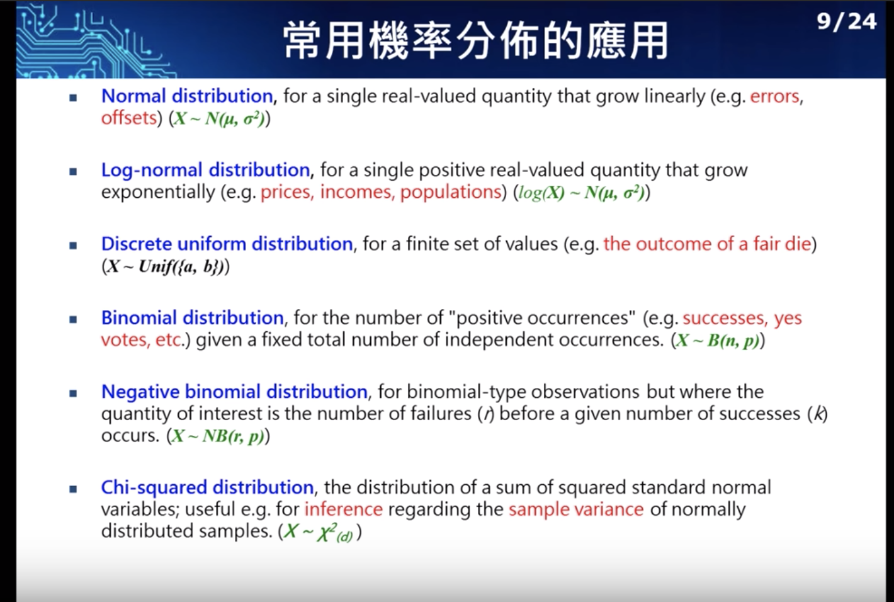
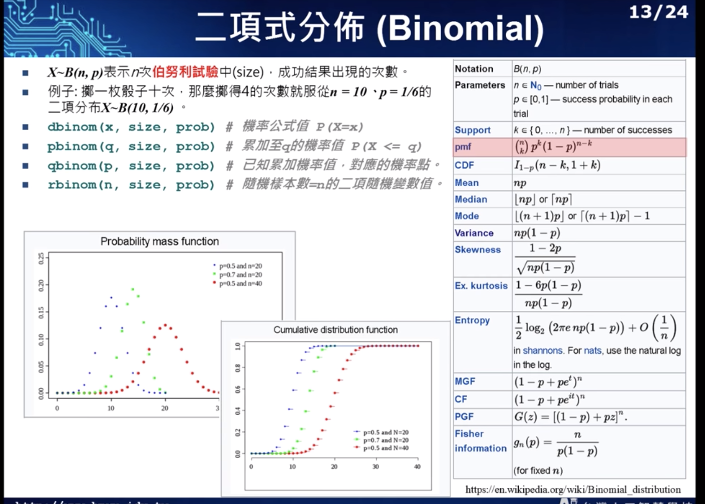
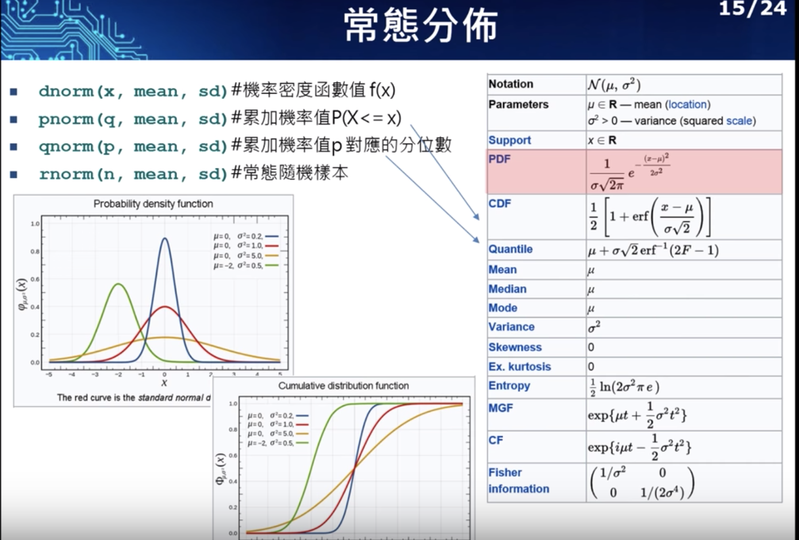

# 機率與統計
[搭配其他人的筆記才吃得下去](https://medium.com/@baubibi/%E9%80%9F%E8%A8%98ai%E8%AA%B2%E7%A8%8B-%E7%B5%B1%E8%A8%88%E8%88%87%E8%B3%87%E6%96%99%E5%88%86%E6%9E%90-%E4%B8%80-d3efa1e42db5)
敘述統計
推論統計
學好統計變好你的人生
miu: 平均(mean)
sigma: 變異數(var)
## mapping
|ML|Statistic|
|:--:|:--:|
|network, graph|model|
|weights|parameters|
|learning|fitting|
|generalization|test set performance|
|supervised learning|regression/classification|
|unsupervised learning|density estimation/clustering|

## 資料的屬性
名目變數/ 類別資料
順序型資料
interval資料
連續型
[變異數](https://zh.wikipedia.org/wiki/%E6%96%B9%E5%B7%AE)
處理資料的思維
* 觀察資料
1. 確認資料中心趨勢: 平均數(avg) / [中位數](https://zh.wikipedia.org/wiki/%E4%B8%AD%E4%BD%8D%E6%95%B8)(median) / 眾數(mode)
2. 資料分散程度:[四分位數](https://zh.wikipedia.org/wiki/%E5%9B%9B%E5%88%86%E4%BD%8D%E6%95%B0)(quartile, 25 / 50 / 75) / 全距(range) / 四分位距(interquartile range, IQR 第一四分位和第三四分位中間的距離) / 百位數(percentile) / [標準差](https://zh.wikipedia.org/wiki/%E6%A8%99%E6%BA%96%E5%B7%AE)(std deviation, 每一點到平均的距離開根號) / 變異數(variance)
   * 離群值: 超出 第一四分位 - 1.5*IQR || 第三四分位 + 1.5 IQR 的點
   * [偏態係數](http://estat.ncku.edu.tw/topic/desc_stat/base/Skewness.html): <0偏左邊(mode > median > avg), >0偏右邊, =0對稱
   * [峰態係數](http://estat.ncku.edu.tw/topic/desc_stat/base/Kurtosis.html): <0 低潤豐, >0高峽峰, =0常態峰
## 距離與相關係數量測指標
[維度縮減](https://murphymind.blogspot.com/2017/07/machine-learning-dimensionality.html)
特徵值分解
[皮爾遜積差相關係數](https://zh.wikipedia.org/zh-tw/%E7%9A%AE%E5%B0%94%E9%80%8A%E7%A7%AF%E7%9F%A9%E7%9B%B8%E5%85%B3%E7%B3%BB%E6%95%B0): 用於度量兩的變數的相關程度, -1~1, 對線性關係反應好, 對具outline的關係反應不真實
[spearman rank correlation](https://zh.wikipedia.org/wiki/%E6%96%AF%E7%9A%AE%E5%B0%94%E6%9B%BC%E7%AD%89%E7%BA%A7%E7%9B%B8%E5%85%B3%E7%B3%BB%E6%95%B0): 具有等級排序的皮爾遜相關係數, -1~1, 對線性關係反應好
[kendall's tau](https://statistics-using-r.blogspot.com/2018/05/kendall-tau-rank-correlation-coefficient.html): 查看兩組變數是否具有一致性
[共變異數](https://zh.wikipedia.org/wiki/%E5%8D%8F%E6%96%B9%E5%B7%AE)
## 高維度資料的三種類型
* p(變數) is larget but smaller than n(樣本數)
* p is larget and larger than n: HDLLS, examples: 影像、基因
* data are functions of a contunuous variable d: the functional data
高維度資料的問題：
越高維度分布越稀疏, 越難以進行運算
* 處理異常共變異數矩陣(HDLSS的資料會出現)的方法: shrinkage / penalized / regularized
# 機率分佈
## 隨機實驗
outcome: 結果
sample space: 樣本空間
event: 樣本空間內的子集合
trail: 隨機實驗內的最小單位
投擲硬幣的outcome={10,11,00,01}
Probability: 隨機實驗長期執行下來的結果中有興趣得那次長期發生下來的比例, E, P(E)
機率分佈: 以數學函式來表示隨機試驗中不同的可能結果(樣本空間內每個元素發生的可能性)

[PDF, PMF, CDF](https://blog.csdn.net/wzgbm/article/details/51680540)
[機率質量函數(pmf)](https://zh.wikipedia.org/wiki/%E6%A6%82%E7%8E%87%E8%B4%A8%E9%87%8F%E5%87%BD%E6%95%B0): 離散型
[機率密度函數(pdf)](https://zh.wikipedia.org/wiki/%E6%A9%9F%E7%8E%87%E5%AF%86%E5%BA%A6%E5%87%BD%E6%95%B8): 連續型, 計算某個事件在連續行事件發生的機率實際上就是計算他的積分
[累積分佈函數(cdf)](https://zh.wikipedia.org/wiki/%E7%B4%AF%E7%A7%AF%E5%88%86%E5%B8%83%E5%87%BD%E6%95%B0)
## 應用
 
## 累積機率分配函數
變數小於N的機率
## 分位數
給訂一個累積機率分佈, 小於變數x的比率占總的 n %, 則稱 x 為 n 的分位數
常用於信賴區間
## 常見的分佈
* 二項式分佈(離散): n次[柏努利試驗](https://zh.wikipedia.org/wiki/%E4%BC%AF%E5%8A%AA%E5%88%A9%E8%A9%A6%E9%A9%97)後成功結果出現的次數

* 常態分佈(連續)

* 以常態機率逼近二項式機率
## 重點原理
* [大數法則](https://zh.wikipedia.org/wiki/%E5%A4%A7%E6%95%B0%E5%AE%9A%E5%BE%8B)
實驗越多次平均數有越高機率接近期望值
* [中央極限定理](http://www.math.nsysu.edu.tw/StatDemo/CentralLimitTheorem/CentralLimit.html)
抽的樣本數夠多的時候, 平均數會近似常態分配, 30以上為常見值, 母體為常態分配時抽樣分配即為常態分配
[視覺化理解統計理論](https://seeing-theory.brown.edu/)

## 參數估計
利用樣本統計量及其抽樣分配來對母體參數進行推估, 以了解母體的特性
* 點估計
[概似函數](https://zh.wikipedia.org/wiki/%E4%BC%BC%E7%84%B6%E5%87%BD%E6%95%B0)
[最大概似估計法(MLE)](https://zh.wikipedia.org/wiki/%E6%9C%80%E5%A4%A7%E4%BC%BC%E7%84%B6%E4%BC%B0%E8%AE%A1)
* 點估計步驟
1.  抽取代表性樣本
2.  選擇一較佳的樣本統計量當估計式
3.  計算估計式的估計值
4.  以該估計值推論母體參數並做決策
* 區間估計
先對未知母體參數球點估計值, 然後於一信賴水準下導出一個區間, 此區間稱為信賴區間, 信賴水準是該區間包含母體參數的可靠度
* [貝氏定理](https://zh.wikipedia.org/wiki/%E8%B4%9D%E5%8F%B6%E6%96%AF%E5%AE%9A%E7%90%86)
P(A|B): 已知在 B 發生的情況下 A 發生的機率(B又稱作A的後驗機率)
P(A), P(B): A,B的事前(先驗)機率
P(B|A): 已知發生 A 後, B 的條件機率(a.k.a 概似函數)
後驗機率 = (可能性 * 先驗機率) / 標準化常量
* [貝式統計](https://medium.com/@fammy/%E8%B2%9D%E6%B0%8F%E4%BC%B0%E8%A8%88-%E5%90%B3%E6%BC%A2%E9%8A%98%E8%80%81%E5%B8%AB%E7%B5%B1%E8%A8%88%E8%AA%B2%E7%A8%8B-8a7299d17090)
