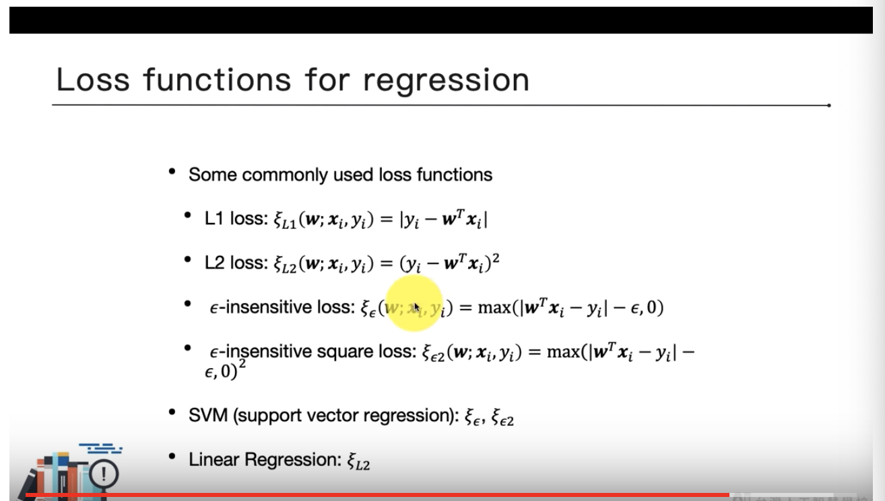

# 教材
* [ppt](https://docs.google.com/presentation/d/1t5WjXI_pwcWvEYDaCquGEjJI8MvyIkhiZW4PqdtAXSs/edit)
* [video](https://www.youtube.com/playlist?list=PL1f_B9coMEeCvbetNGYmW7fWUBSo0-D_i)
* [18](18.md)
* [19](19.md)
* [20](20.md)
* [21](21.md)

1. 最小化margin導數
2. 允許小量錯誤會影響margin size變大的話的話可能是ok(表示model比較general)
# summary
1. large margin: prevent overfitting
2. soft margin: make the margin become larger to prevent overfitting
3. kernel trick
   1. make the data linearly separable
   2. 有效率的把低維特徵轉換成高維特徵
# regularize linear regression
解釋SVM, logistic, linear的不同角度

# [SVM concept](https://www.youtube.com/watch?v=Er2mx9rFWgo&list=PL1f_B9coMEeCvbetNGYmW7fWUBSo0-D_i&index=5)
使用kernel trick 避免需要做在linear regression時手動生成高次方的feature｀
# [SVM for linear regression (SVR)](https://www.youtube.com/watch?v=8acMZIIRij4&list=PL1f_B9coMEeCvbetNGYmW7fWUBSo0-D_i&index=7)
# [summary](https://www.youtube.com/watch?v=TaBfrURIqf4&list=PL1f_B9coMEeCvbetNGYmW7fWUBSo0-D_i&index=8)
用C做控制模型對誤差的容忍度
調整 degree or gamma 來增加模型的複雜度
|linear|logistic|SVM|
|:--|:--|:--|
|連續值預測|分類問題預測|兩者皆可|
|alpha 越大控制力越強|C 越大控制力越弱|C 越大控制力越弱|
