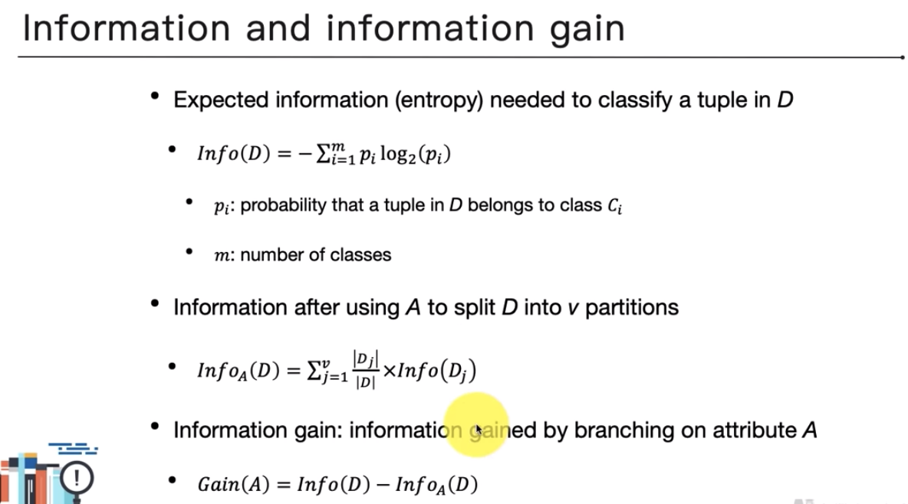
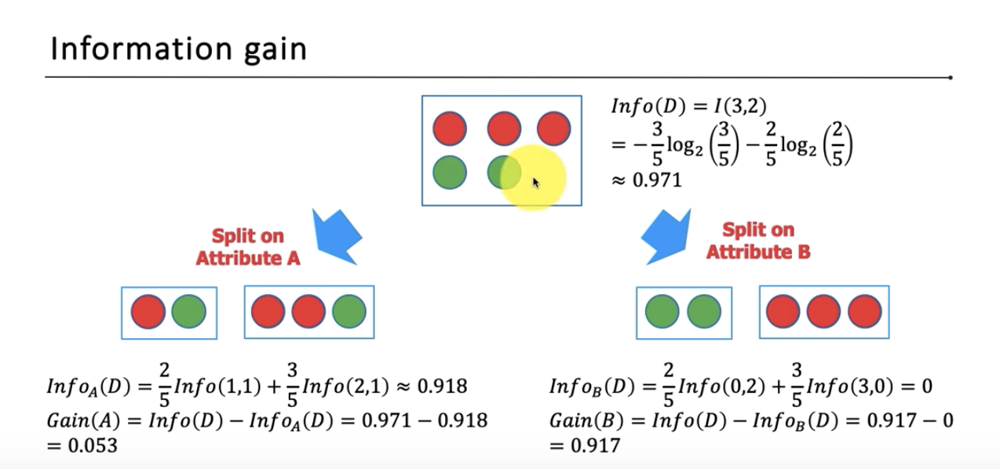

# 教材
* [ppt](https://docs.google.com/presentation/d/1GY6Z14ybAu0xxVZI03iBjUHg206LOZ-1KWTVP-af9FA/edit#slide=id.p1)
* [video](https://www.youtube.com/watch?v=8MR5sRyd6zQ&list=PL1f_B9coMEeDnlocZvO4vREgupj3TWhh5)
* [22](22.md)
* [other note](https://mropengate.blogspot.com/2015/06/ai-ch13-2-decision-tree.html)
# decision tree
給定新樣本的features, 根據input features訓練時產生的規則決定新的output是什麼
## 產生樹的方式

entropy: 衡量一個分布有多亂, 一半一半是很亂的
define: 0*log0 := 0
* 如何決定 root node
分別計算個info與gain, 進步幅度最大(info最小)的即可
* quiz
1. ooxx ooxxx ooo 中第一個最亂
2. numerical attributes 怎麼用 dt? 把數值區段化即可
* gain ratio: 越高越純
避免 info gain 會選擇很多值欄位的問題
* gini index: 越高越亂
gain = gini(D) - ginia(D), 越高表示方式越好
## overfitting
* 砍樹\
alpha = (err after cut - err before cut) / leaves been cut - 1
## 注意事項
* regression tree\
* [quiz](https://www.youtube.com/watch?v=kzl208Ra_QA&list=PL1f_B9coMEeDnlocZvO4vREgupj3TWhh5&index=12): 在全數值的training data中, 哪個預測需要花最多時間?
* KNN
KNN: 需要看完所有的 training data 後再計算鄰居判斷其label
* logistic: 訓練完就知道每個feature對預測結果的重要度, 在待測樣本不多的話很快
* dt: 同一個feature可能被看很多次, 只需要樣本本身, 不用看所有data

# [實作](https://www.youtube.com/watch?v=dd6_Uuk_EMA&list=PL1f_B9coMEeDnlocZvO4vREgupj3TWhh5&index=13)
# summary
* 掃過所有feature做切分
* 用 gini or entropy衡量資料純度
* 不作限制容易 overfitting
* 可透過 feature importance 排序
## 改進方法
* bagging: 透過重複抽樣的方式產出許多樹, 用投票決定結果, 常用 random forest
* boosting: 產出許多對個data設定不同權重的樹, 用投票決定結果
