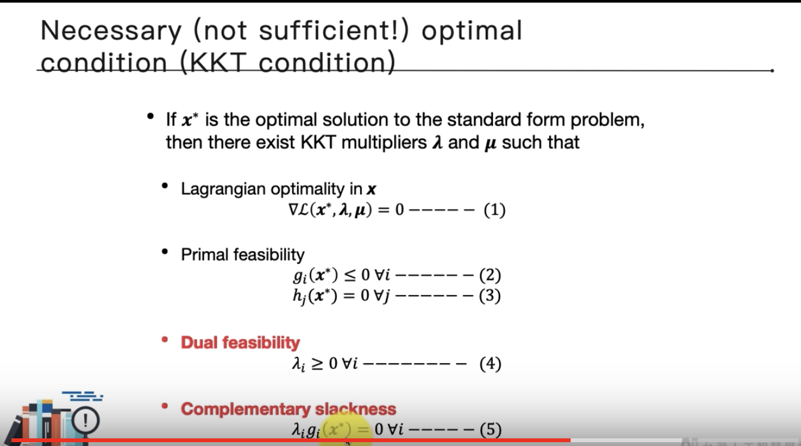

# [Lagrange multiplier & KKT condition](https://www.youtube.com/watch?v=MAjskeeDBpc&list=PL1f_B9coMEeCvbetNGYmW7fWUBSo0-D_i&index=2)
kernel SVM前置知識

有 equality constraints 的最佳化問題可以用 lagrange multiplier 求解
how about inequality constraints? generalized lagrange multiplier(short for glm)
要找到符合條件的求解 glm 的 X 必須滿足KKT condition
* equality constraints: 結果是在有限的範圍內
* inequality constraints: 結果是在無限的範圍內
* KKT

* summary
有限制條件時可能無法用GD/GA
Lagrange multiplier 在equality / inequality 限制時可能有用
