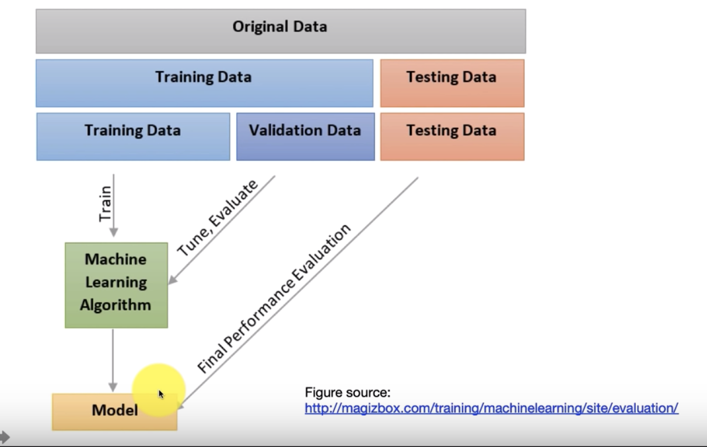

# [practical concerns](https://www.youtube.com/watch?v=DucQmHOwMxg&list=PL1f_B9coMEeDPl3dZ_ZmoDB1A2gjPa3hg&index=12)

## transforming features(feature scaling)
數值類
* min-max scaling: scale to [-1, 1] or [0, 1]
* standardize: scale to N(0, 1)
* robust scaling: removing outliers
* thresholding: 選定某個門檻, 大於該值為1, 小於為0
* applying log or exponential function
## why scaling
* KNN
避免計算distance時避免距離被少數的feature dominated
* linear, logistic, SVM
做優化會比較方便
通常使用GA or GD做優化, 他們都有hyper parameter要決定, normalize後可以避免兩個不同feature造成差異過大的影響
* DT
not important, 通常不會有明顯壞處
## log and exp
右偏->常態: log
左偏->常態: exp
## missing values
* categorical: 用最常見的值補值
* numerical: 用median or mean補值
## imbalanced classification
因大部分的分類算法在正負樣本比例相近時表現較好
* under-sample majority class: 數量較多的僅取少部分
* over-sample minority class: 讓數量較少的做resample
* 結合兩者
## data preprocessing summary
1. consider transform features
2. fill missing values
3. generating synthetic instances(正負樣本比例懸殊時, 讓兩者差距縮小)

# [selecting hyper-parameters](https://www.youtube.com/watch?v=Q-XXrbFSPts&list=PL1f_B9coMEeDPl3dZ_ZmoDB1A2gjPa3hg&index=13)
有幾種選擇方法
* grid search(可平行)
直接列出幾個值做組合, try and error, 有足夠多的資源比較好做平行
* random search(可平行)
通常比grid效果更好, 因為在比較重要的parameter中, grid search嘗試的次數可能少於random search
* bayesian optimization(難以平行)
從一組中挑, 看結果決定是不是要繼續在這群裡面挑

## 衡量 hyper-parameters
用training or test去測都不準
應該切成 training, validation, test
1. use different hyper-parameters train models
2. use validation to test performance
   1. combine training and validation as new training data then test with test data

## 多類別的分類
* leverage on binary classifier
one-vs-rest: 為每個class訓練一個classifier, 選個個分類器最好的結果, 把其中一個當成正樣本, 其他當成副樣本
one-vs-one: 任兩個建立一個classifier, 做排列組合, 看最後哪個組合最好
熟快熟慢沒有絕對

# [bias vs variance](https://www.youtube.com/watch?v=5EPAzA4mD3k&list=PL1f_B9coMEeDPl3dZ_ZmoDB1A2gjPa3hg&index=16&t=5s)
bias: error from diff between true model and learning model
variance: error from sensitivity to small fluctuactions in training data
noise: error from the data per se

模型(複雜度)固定, 當姿要越多時testerror, training error 會越趨相近

可能的sop
1. 現有模型在 training data 上表現是否 ok
2. 在 test data 上好不好

#summary
* domain knowledge is important
* model complexity is important
  * applying simple model on massive data is underfitting
  * select an algo. that is complex enough to fit data well
* data size is important
  * applying complexity model on small data is overfitting
  * collect data that is large enough to prevent overfitting
